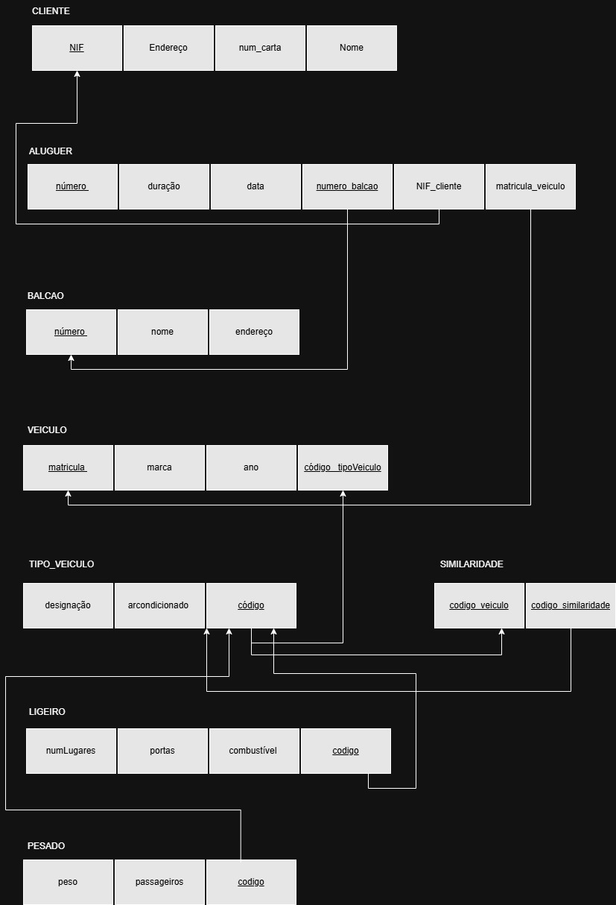
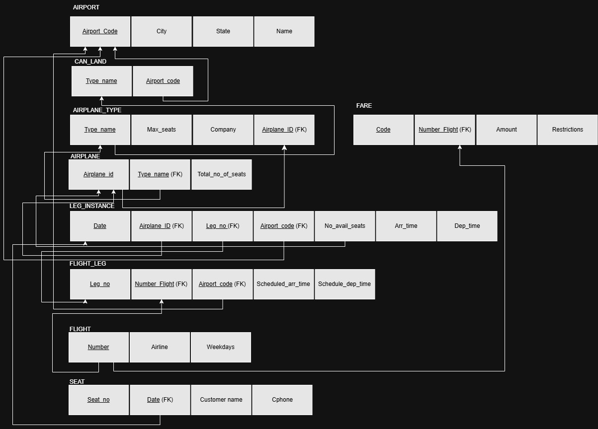

# BD: Guião 3

## ​Problema 3.1

### _a)_

```
Cliente(nome, endereço, num_carta, NIF)
Aluguer(duracao, número, data)
Balcao(nome, numero, endereço)
Veiculo(marca, matricula, ano)
Tipo_Veiculo(codigo, arcondicionado, designacao)
Similaridade(codigo_veiculo, codigo_similaridade)
Ligeiro(numluares, portas, combustivel)
Pesado(peso, passageiros)
```

### _b)_

```
chaves candidatas: CLIENTE: NIF, num_carta; ALUGUER: número; BALCÃO: endereço, número; VEICULO: matrícula; TIPO_VEICULO: codigo, designacao

chaves primarias: CLIENTE: NIF, ALUGUER : numero, BALCAO: numero, VEICULO: matrícula, TIPO_VEICULO: código

chaves estrangeiras: NIF_cliente, num_balcão, matricula_veiculo, código
```

### _c)_



## ​Problema 3.2

### _a)_

```
Airport(Airport code, city, state, name)
Can_Land(Airport_code, Type_name)
Airplane_Type(Max_seats, Type_name, Company)
Airplane(Airplane_id, Total_no_of_seats, Type_name)
Leg_instance(Airplane_id, No_avail_seats, Date, Leg_no)
Flight_leg(Leg_no, Airport_code, number, Scheduled_dep_time, Scheduled_arr_time)
Flight(Number, Airline, Weekdays)
Fare(Code, Number, Amount, Restrictions)
Seat(Seat_no, Customer_name, Cphone, Date)
```

### _b)_

```
Chaves candidatas:
AIRPORT(Airport code, name)
CAN_LAND(Airport_code, Type_name)
AIRPLANE_TYPE(Type_name)
AIRPLANE(Airplane_id)
LEG_INSTANCE(Airplane_id, Date, Leg_no)
FLIGHT_LEG(Leg_no, Number_Flight)
FLIGHT(number)
FARE(Code, number_Flight)
SEAT(Seat_no, Customer_name, Date)

Chaves primarias:
AIRPORT(Airport code)
CAN_LAND(Airport_code, Type_name)
AIRPLANE_TYPE(Type_name)
AIRPLANE(Airplane_id, Type_name)
LEG_INSTANCE(Date, Leg_no)
FLIGHT_LEG(Leg_no, Number_Flight)
FLIGHT(number)
FARE(Code, Number_Flight)
SEAT(Seat_no, Date)

Chaves estrangeiras:
AIRPORT()
CAN_LAND(Airport_code)
AIRPLANE_TYPE()
AIRPLANE(Type_name)
LEG_INSTANCE(Airplane_id, Leg_no)
FLIGHT_LEG(Number_Flight, Airport_code)
FLIGHT()
FARE(Number_Flight)
SEAT(Date)

```

### _c)_



## ​Problema 3.3

### _a)_ 2.1


### _b)_ 2.2


### _c)_ 2.3


### _d)_ 2.4


